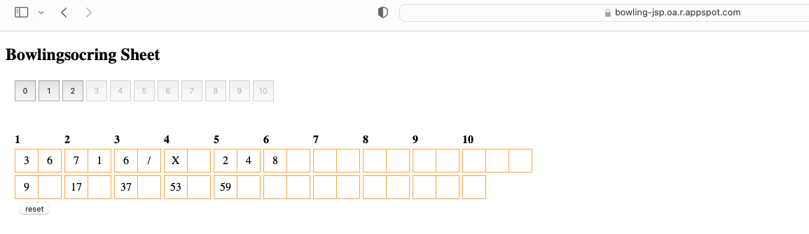

in order to deploy to google cloud app engine

the appengine-maven-plugin is required
web.xml should remain the same way, eventuelly the appengine:deploy step will generate in target the appengine-staging
folder, which contains the app.yaml

